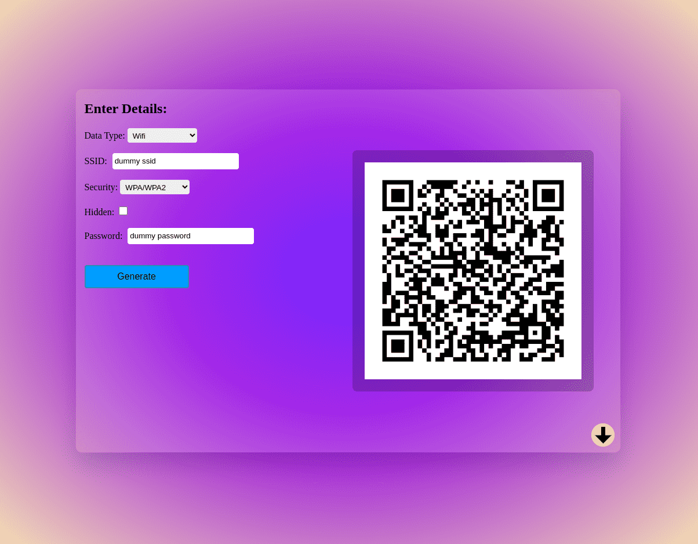

## Generate QR code with awesome UI on local server made with Flask

### Take a look at <a href="https://rajmani7584.github.io/QRCodeGenerator">Demo</a>

## Installation

Clone this repo:

```git clone https://github.com/Rajmani7584/PyQRCodeGenerator```

```cd PyQRCodeGenerator```

### Install required packages

```pip install -r requirements.txt```

```python3 main.py```

### Then Go to <a href="http://localhost:5000">http://localhost:5000</a>



